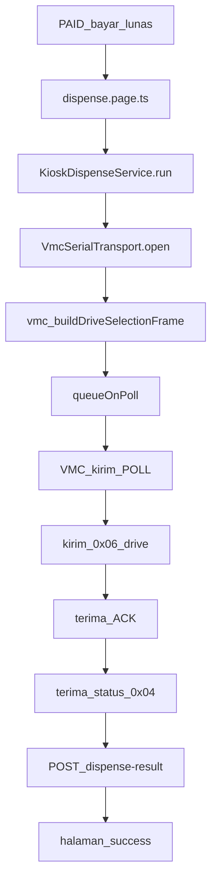

# Hardware kiosk ↔ VMC (penjelasan dari nol)

Dokumen ini menjelaskan folder `hardware/` seperti cerita sederhana:  
**siapa bicara dengan siapa, file mana mulai dulu, lalu kemana sampai barang keluar.**

---

## 1. Analogi (biar gampang)

Bayangkan mesin vending seperti toko + gudang otomatis:

| Bagian | Analogi | Tugas |
|--------|---------|--------|
| **Layar Android (kiosk Samakan)** | Kasir | Pilih menu, terima bayar, minta “keluarkan slot 013” |
| **VMC** | Otak mesin / operator gudang | Putar motor, naikkan lift, panaskan, laporkan sukses/gagal |
| **Kabel RS232 (+ converter USB)** | Walkie-talkie | Jalur bicara kasir ↔ otak mesin |
| **Folder `hardware/`** | Buku bahasa + radio | Susun pesan + kirim/terima lewat kabel |

Bayar QRIS = internet ke server.  
**Keluarin barang = hanya lewat `hardware/` + kabel ke VMC.** Dua dunia berbeda.

---

## 2. Singkatan (wajib paham)

| Singkatan | Kepanjangan / arti | Penjelasan anak-anak |
|-----------|--------------------|----------------------|
| **VMC** | Vending Machine Controller | “Otak mesin” di dalam lemari — yang menggerakkan motor |
| **RS232** | Serial communication | Cara lama komputer bicara lewat kabel, byte demi byte |
| **USB** | Universal Serial Bus | Colokan USB di Android |
| **OTG** | On-The-Go | Android jadi “komputer host” supaya bisa kenali converter USB |
| **UART** | Universal Asynchronous Receiver/Transmitter | Inti chip yang kirim/terima serial (di balik RS232/USB) |
| **POLL** | Query / “ada perintah?” | VMC tiap ~200ms nanya ke kiosk: “mau kirim perintah?” |
| **ACK** | Acknowledge | Jawaban “OK, saya mengerti” / “tidak ada perintah” |
| **CMD** | Command | Nomor perintah dalam paket (mis. `0x06` = keluarkan slot) |
| **XOR** | Exclusive OR checksum | Angka cek di akhir paket supaya data tidak rusak di jalan |
| **8N1** | 8 data bits, No parity, 1 stop bit | Aturan bentuk bit di kabel (sama seperti PDF) |
| **Baud / 57600** | Kecepatan bit per detik | Seberapa cepat byte dikirim (57600 = aturan XY) |
| **Frame** | Satu paket lengkap | Satu “surat” utuh: header + isi + XOR |
| **PackNO** | Communication number | Nomor urut surat (supaya resend pakai nomor sama) |
| **Selection** | Nomor slot di mesin | Mis. `013` = loker Bakpao (sama di portal XY) |
| **Elevator** | Lift di dalam mesin | Naikkan produk (sering dipakai jalur panas/microwave) |
| **Drop sensor** | Sensor jatuh | Deteksi barang sudah jatuh / sampai |
| **Hex / `0x`** | Bilangan heksadesimal | Cara tulis byte: `0x06` = angka 6, `FA FB` = header |
| **Loopback** | Putar balik palsu | Tidak ke mesin nyata; kode pura-pura jadi VMC (untuk browser/test) |
| **Capacitor** | Bridge app web → Android native | Supaya TypeScript bisa buka USB di APK |

---

## 3. Peta folder

```
src/app/hardware/
├── README.md                 ← file ini (cerita lengkap)
├── vmc/                      ← “kamus bahasa” (susun & baca byte)
│   ├── index.ts
│   ├── types.ts
│   ├── constants.ts
│   ├── selection.ts
│   ├── frame.ts
│   ├── commands.ts
│   ├── status.ts
│   ├── vmc-protocol.spec.ts
│   └── README.md
└── serial/                   ← “radio / kantor pos” (kirim & terima)
    ├── types.ts
    ├── base64.ts
    ├── loopback-serial.driver.ts
    ├── capacitor-usb-serial.definitions.ts
    ├── capacitor-usb-serial.driver.ts
    ├── vmc-serial.transport.ts
    ├── vmc-loopback.simulator.ts
    ├── serial-transport.spec.ts
    └── README.md

Dipakai oleh (di luar folder ini):
  src/app/services/kiosk-dispense.service.ts   ← sutradara “keluarkan barang”
  src/app/dispense/dispense.page.ts            ← layar “Mengeluarkan…”
```

---

## 4. Siapa memulai percakapan?

Menurut PDF protokol XY:

- **VMC = host (bos)** → yang selalu mulai dengan **POLL**
- **Kiosk = slave (anak buah)** → hanya menjawab setelah POLL, ≤ 100ms

Jadi kiosk **tidak** boleh sembarangan kirim “keluarkan!” kapan saja.  
Harus: **tunggu POLL → baru kirim command** (itu gunanya `queueOnPoll`).

```
tiap ~200ms:
  VMC  →  POLL     “ada perintah?”
  Kiosk →  ACK     “tidak ada”
     atau
  Kiosk →  CMD 0x06 “keluarkan slot 013”
  VMC   →  ACK     “perintah diterima”
  VMC   →  status 0x04  “lagi panaskan / sukses / gagal”
```

---

## 5. File demi file — `vmc/` (kamus bahasa)

Tidak menyentuh USB. Hanya: **arti byte** dan **susun paket**.

| File | Guna (bahasa sederhana) |
|------|-------------------------|
| **`index.ts`** | Pintu depan. File lain import dari sini supaya rapi. |
| **`types.ts`** | Cetakan data TypeScript (bentuk objek frame, opsi drive, dll). |
| **`constants.ts`** | Angka tetap: baud 57600, kode CMD (`0x06`, `0x04`, POLL, ACK), kode status sukses/gagal. |
| **`selection.ts`** | Ubah tulisan slot `"013"` jadi 2 byte (`00 0D`) yang dimengerti VMC. |
| **`frame.ts`** | Bungkus surat: `FA FB \| CMD \| LEN \| data \| XOR`. Juga buka surat mentah jadi frame. |
| **`commands.ts`** | Siapkan surat siap kirim: ACK, POLL (jarang), **drive selection 0x06**, select-to-buy, dll. |
| **`status.ts`** | Baca surat status `0x04`: “sukses”, “lagi heating”, “macet”, dll. |
| **`vmc-protocol.spec.ts`** | Ujian otomatis: apakah frame Bakpao `013` XOR-nya benar. |
| **`README.md`** | Catatan singkat protokol (detail cerita ada di README induk ini). |

**Contoh isi surat drive (4.3.5):**  
`FA FB 06 05 01 01 01 00 0D 0E`  
artinya kira-kira: command drive, packNo=1, drop sensor ON, elevator ON (heat), selection 013, XOR cek.

---

## 6. File demi file — `serial/` (radio / kabel)

| File | Guna (bahasa sederhana) |
|------|-------------------------|
| **`types.ts`** | Kontrak “driver serial”: harus bisa `open`, `write`, `close`, dan stream terima byte. |
| **`base64.ts`** | Plugin Android suka kirim data sebagai teks base64; file ini ubah ↔ byte mentah. |
| **`loopback-serial.driver.ts`** | Radio palsu di browser: “kirim” tidak ke mesin, hanya muter di memori. |
| **`capacitor-usb-serial.definitions.ts`** | Daftar fungsi plugin USB (TypeScript tahu bentuk API-nya). |
| **`capacitor-usb-serial.driver.ts`** | Radio asli di Android: buka USB serial, minta izin, tulis/baca byte. |
| **`vmc-serial.transport.ts`** | **Petugas radio utama**: buka 57600, potong byte jadi frame, auto-jawab POLL, antre command (`queueOnPoll`). |
| **`vmc-loopback.simulator.ts`** | Aktor yang pura-pura jadi VMC di browser: kirim POLL, ACK, lalu status sukses. |
| **`serial-transport.spec.ts`** | Ujian otomatis: POLL → ACK / kirim command. |
| **`README.md`** | Catatan singkat setup Android. |

---

## 7. Alur lengkap dari 0 sampai selesai

### Starting point (setelah bayar lunas)

1. User bayar QRIS → status order **PAID**  
2. Halaman **`dispense.page.ts`** dibuka  
3. Panggil **`KioskDispenseService.run({ slot_code, heat_requested })`**  
   ← **ini pintu masuk bisnis**; hardware dipanggil dari sini

### Langkah A — pilih mode

Di `kiosk-dispense.service.ts` → `resolveMode()`:

| Mode | Kapan | Apa yang terjadi |
|------|--------|------------------|
| `auto` | default | Android → `hardware`; browser → `loopback-sim` |
| `hardware` | APK + USB | Bicara ke VMC nyata |
| `loopback-sim` | browser / demo | Simulator VMC (motor tidak jalan) |
| `mock` | fallback | Cuma delay beberapa detik, tanpa protokol |

### Langkah B — buka “radio”

`VmcSerialTransport.open()`:

- Android → `CapacitorUsbSerialDriver` (USB–RS232)  
- Browser / `forceLoopback` → `LoopbackSerialDriver`  
- Kalau `loopback-sim` → nyalakan `VmcLoopbackSimulator` (kirim POLL palsu)

### Langkah C — susun perintah

`buildDriveSelectionFrame(...)` dari **`vmc/commands.ts`**  
(+ `selection.ts` + `frame.ts` + `constants.ts`)

Hasil: `Uint8Array` siap kirim (belum dikirim).

### Langkah D — antre, tunggu POLL

`serial.queueOnPoll(driveFrame)`:

- Perintah **disimpan**  
- Saat frame POLL datang → transport **langsung kirim** drive  
- Kalau tidak ada antrean → balas **ACK** saja

### Langkah E — tunggu jawaban mesin

1. Tunggu **ACK** (command diterima)  
2. Tunggu **status 0x04** (`status.ts`): progress (heating) atau terminal (sukses/gagal)

### Langkah F — selesai ke server & UI

- Sukses/gagal → halaman `dispense` panggil API **`POST dispense-result`**  
- Sukses → layar **/success** (“silakan ambil”)  
- Gagal → tampil error (timeout USB, tidak ada device, status error VMC, dll.)



---

## 8. Urutan baca kode (kalau mau belajar)

1. **`hardware/README.md`** (file ini) — peta besar  
2. **`services/kiosk-dispense.service.ts`** — `run()` / `runVmc()`  
3. **`serial/vmc-serial.transport.ts`** — `open`, `queueOnPoll`, jawab POLL  
4. **`vmc/commands.ts`** — `buildDriveSelectionFrame`  
5. **`vmc/frame.ts`** + **`selection.ts`** — bentuk paket & slot  
6. **`serial/capacitor-usb-serial.driver.ts`** — USB Android  
7. **`serial/vmc-loopback.simulator.ts`** — kenapa di browser “sukses” tanpa motor  

---

## 9. Mode & environment

Di `src/environments/environment.ts` → `vmc.mode`:

- **`auto`** — paling sering dipakai  
- **`hardware`** — wajib ada converter USB–RS232 + izin USB  
- **`loopback-sim`** — latihan UI tanpa mesin  
- **`mock`** — delay saja  

Ingat: di browser, “dispense sukses” **bukan** berarti motor jalan — itu simulator.

---

## 10. Setting kabel (dari PDF)

| Setting | Nilai |
|---------|--------|
| Baud | **57600** |
| Format | **8N1** |
| Host | **VMC** (kirim POLL) |
| Slave | **Kiosk** (jawab ≤100ms) |
| Header frame | **`FA FB`** |

---

## 11. Tahap pengerjaan

| Tahap | Isi | Status |
|-------|-----|--------|
| 1 | Protokol `vmc/` | Selesai |
| 2 | Serial `serial/` | Selesai |
| 3 | `KioskDispenseService` + halaman dispense | Selesai |
| 4 | Uji mesin nyata (kabel, endian, heat/elevator) | Menyusul di lapangan |

---

## 12. Ringkas satu kalimat

**`vmc/` = cara menulis surat ke mesin; `serial/` = cara mengirim surat lewat kabel; `KioskDispenseService` = orang yang memutuskan kapan surat “keluarkan slot X” dikirim setelah bayar lunas.**
